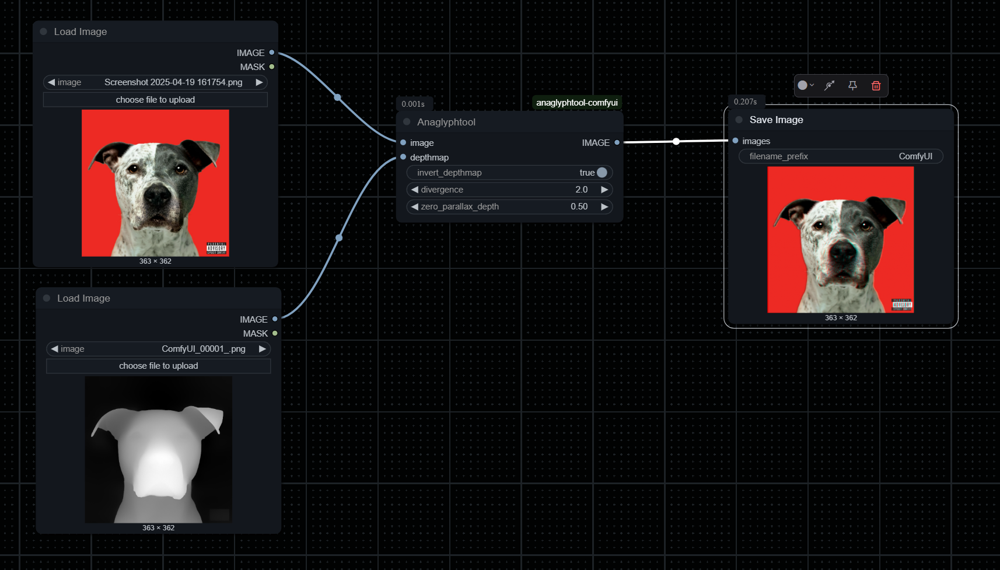
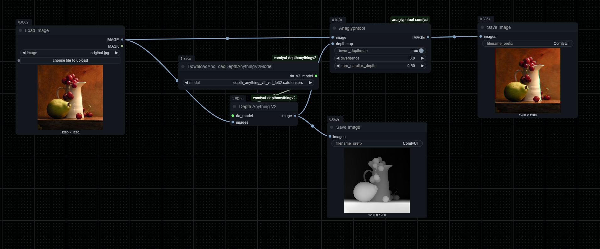
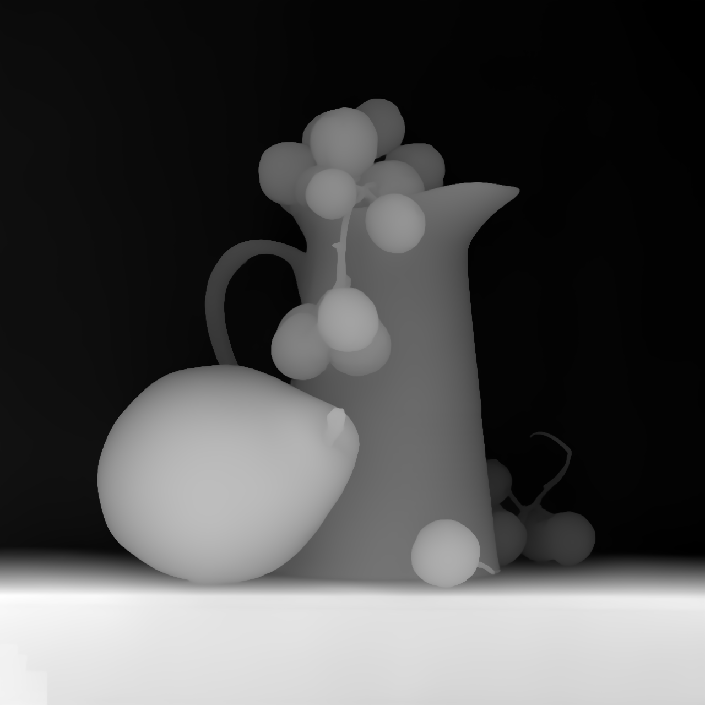
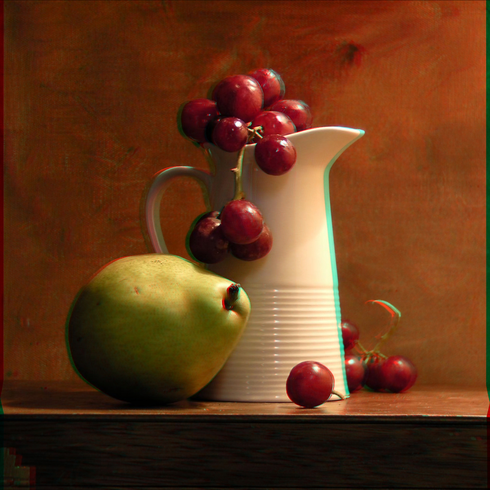
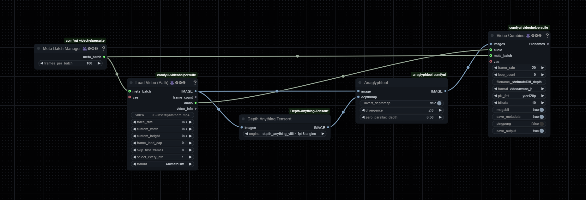

# anaglyphTool-Comfyui
A high-performance ComfyUI custom node for creating anaglyph 3D images from color and depth map inputs. Optimized for CUDA GPU acceleration, making it suitable for video to anaglyph conversion.

## Features

- CUDA GPU accelerated processing
- Batch processing support for video frames
- Adjustable parallax and depth settings
- Real-time depth map inversion option

## Installation

1. Navigate to your ComfyUI custom_nodes folder
2. Clone this repository:
```bash
git clone https://github.com/Cryptyox/anaglyphTool-Comfyui
```
3. Install dependencies:
```bash
pip install -r requirements.txt
```
only torch should be required and can be installed manually.

## Usage

The node accepts the following inputs:

- **image**: Input image or video frame (RGB format)
- **depthmap**: Corresponding depth map (grayscale or RGB)
- **invert_depthmap**: Toggle depth map inversion (default: True)
- **divergence**: Controls the 3D effect strength (-10.0 to 10.0, default: 2.0)
- **zero_parallax_depth**: Sets the focal plane (0.0 to 1.0, default: 0.5)

## Examples

[Add example images/workflow screenshots here]

## Requirements

- ComfyUI
- PyTorch with CUDA support (recommended)
- CPU fallback available

## Recommended Workflow

### Basic Usage

*Basic workflow showing image and depth map inputs*



### Results
| Original | Depth Map | Anaglyph Result |
|:--------:|:---------:|:---------------:|
|  |  |  |

### Video Processing Example

*Example workflow for batch processing video frames*

I highly recommend using [Depth Anything Tensorrt](https://github.com/spacewalk01/depth-anything-tensorrt) for the depth map creation to save time. The batch size is a huge factor when it comes to speed. Increase the batch size until your VRAM is full. On a 3090 with 24gb of VRAM you can batch process 500 480p Frames in 0,5s.

**Note**: You'll need red-cyan 3D glasses to view the anaglyph effects.

## License

This project is licensed under CC BY-NC-SA 4.0 - see the [LICENSE](LICENSE) file for details.

## Contributing

Contributions are welcome! Please feel free to submit a Pull Request.

## Acknowledgments

Big shoutout to https://github.com/mikeymcfish who created https://github.com/mikeymcfish/FishTools. This was my original inspiration as I was very fond of his node but needed something capable of bulk processing.
